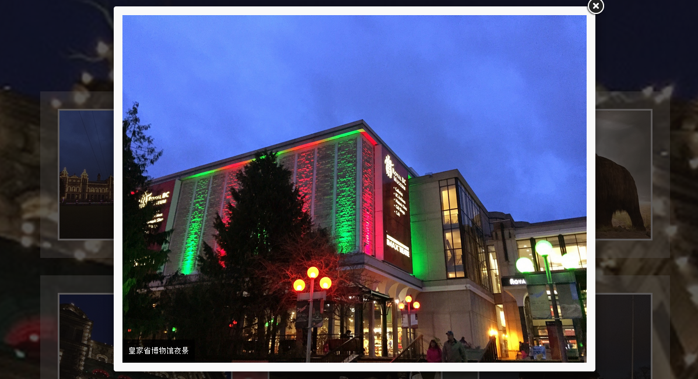

Bootstrap Photo Exibition
=======================
#Usage
Modify **index.html**, replace 1.jpg, 2.jpg (background photo and other photos) with your content.  
Be sure to use a thumbnail in  tag to ensure loading speed.  
  
#Example
 
  
#License
GNU GPL 3.0